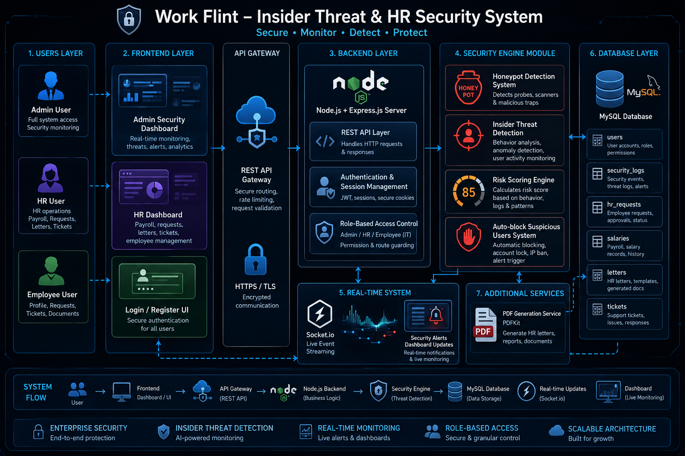

# 🛡 Work Flint – Insider Threat Detection System using Honeypot & Dynamic Access Control

A cybersecurity + HR intelligence simulation system designed to mimic enterprise Security Operations Center (SOC) workflows with real-time threat detection and insider risk monitoring.

Work Flint is a full-stack enterprise-style security monitoring and HR management system built using Node.js, Express, MySQL, and real-time event tracking. It simulates a real-world corporate environment with insider threat detection, HR workflows, and security intelligence systems.

---

# 🎯 Project Goal

This project simulates how real enterprises monitor insider threats using:

- Behavioral risk scoring
- Honeypot deception systems
- Role-based access control
- Real-time security dashboards

It combines HR operations with cybersecurity monitoring to demonstrate full-stack enterprise system design.

---

# 🚀 Features

## 🔐 Security System
- Insider threat detection engine
- Honeypot trap system for attacker detection
- Risk scoring system for users
- Auto-block system for high-risk accounts
- Session-based authentication
- Role-based access control (Admin / HR / IT)

---

## 📊 Admin Security Dashboard
- Real-time security event monitoring
- Live threat feed (Socket.io enabled)
- Critical attack detection
- Top risky users ranking
- Security log tracking from database

---

## 👩‍💼 HR Management System
- Employee payroll management (salary module)
- HR request approval system
- Employee records management
- Attendance and announcements support
- Resource management module
- HR analytics dashboard

---

## 📄 Document & PDF System
- Automated HR letter generation (Offer / Warning / Experience letters)
- PDF download system using PDFKit
- Stored and retrieved from MySQL database

---

## ⚡ Real-Time Backend System
- Express.js REST API backend
- MySQL relational database integration
- Socket.io real-time dashboard updates
- Session timeout handling (1-hour expiry)
- Security event logging system

---

## 🧠 Intelligent Security Logic
- Keyword-based threat detection (root, disable, master, export, surveillance)
- Automatic risk scoring engine
- Honeypot trigger detection
- Behavioral anomaly tracking

---

# 🏗 Tech Stack

- Frontend: HTML, CSS, JavaScript
- Backend: Node.js, Express.js
- Database: MySQL
- Real-time: Socket.io
- PDF Generation: PDFKit
- Authentication: Session-based system

---

## 📐 System Architecture

The Work Flint system follows a secure layered architecture:

### 🧑‍💼 1. Users Layer
- HR Users
- Admin Users
- IT Security Users

⬇

### 🌐 2. Frontend Layer
- HR Dashboard (Payroll, Requests, Letters)
- Admin Security Dashboard (Threat Monitoring)
- IT Security Logs Panel
- Login & Authentication Pages

⬇

### ⚙ 3. Backend Layer (Node.js + Express)
- Authentication Middleware (Session-based)
- Role-Based Access Control (HR / Admin / IT)
- Security APIs (Threat Detection, Honeypot System)
- HR APIs (Payroll, Requests, Letters)
- Risk Scoring Engine

⬇

### 🔐 4. Security Engine
- Honeypot Detection System
- Insider Threat Detection Logic
- Risk Score Calculation
- Auto-block High Risk Users

⬇

### 🗄 5. Database Layer (MySQL)
- users
- security_logs
- hr_requests
- salaries
- letters
- tickets

⬇

### ⚡ 6. Real-Time Layer (Socket.io)
- Live Security Dashboard Updates
- Instant Threat Alerts
- Risk Score Updates in Real-time



---

# 📁 Project Structure

- /frontend → All UI dashboards (Admin, HR, Login)
- /server.js → Main backend server
- /db.js → Database connection
- /routes → Authentication & security APIs

---

# 🔐 Security Features

- Login authentication system
- Role-based route protection
- Session validation middleware
- Honeypot detection system
- Risk scoring per user
- Security logs database tracking

---

# 📊 Database Tables

- users
- security_logs
- hr_requests
- salaries
- tickets
- letters

---

# 📸 Modules Overview

## 🛡 Admin Security Dashboard
- Live attack monitoring system
- Risk scoring visualization
- Security event logs

## 👩‍💼 HR Dashboard
- Payroll system
- HR approvals
- Letter generation
- Employee management system

## 🔍 Security Engine
- Honeypot triggers
- Suspicious activity detection
- Risk score updates

---

# 📦 Installation

```bash
git clone https://github.com/hasini999/work-flint-security-system.git
cd work-flint-security-system
npm install
node server.js
```
---

# 🌐 Run Application
- http://localhost:3000

---

# 🔥 Highlights
- Enterprise-style security simulation
- SOC-style admin dashboard
- HR + Security hybrid system
- Real-time threat detection
- Industry-level backend architecture

---

# 🚀 Future Improvements
- AI-based anomaly detection model
- Email alert system for threats
- Cloud deployment (Render / AWS)
- Advanced analytics charts
- Multi-factor authentication

---

# 👩‍💻 AUTHOR

Prabandala Hasini
