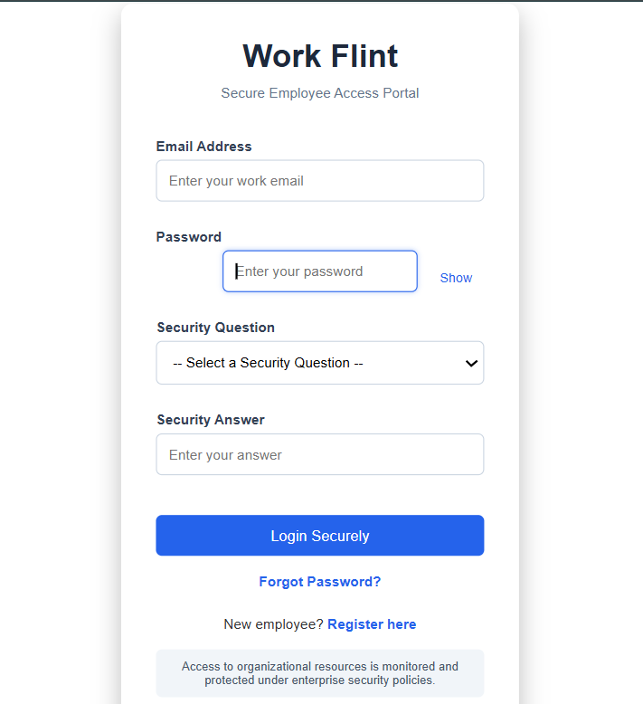

# 🛡 Work Flint – Insider Threat Detection System using Honeypot & Dynamic Access Control

A cybersecurity + intelligence simulation system designed to mimic enterprise Security Operations Center (SOC) workflows with real-time insider threat monitoring, honeypot deception systems, behavioral risk scoring, and dynamic access control.

Work Flint is a full-stack enterprise-style security monitoring and HR management system built using Node.js, Express, MySQL, and real-time event tracking. It simulates a real-world corporate environment with insider threat detection, real-time analytics, and intelligent incident reporting into one integrated enterprise-style system.

---
 
# 🎯 Project Goal

This project simulates how real enterprises monitor insider threats using:

- Behavioral risk scoring
- Honeypot deception systems
- Role-based access control
- Real-time security dashboards
- Dynamic user access control
- Automated user blocking systems

It combines HR and IT operations with cybersecurity monitoring to demonstrate full-stack enterprise system design.

---

# 🚀 Features

## 🔐 Cybersecurity & Insider Threat Detection
- Honeypot trap system for malicious user detection
- Insider threat monitoring engine
- Real-time suspicious activity tracking
- Behavioral risk scoring system
- Auto-block system for high-risk users
- Dynamic access control based on risk score
- Session timeout protection
- Role-based access control (RBAC)
- Security log tracking and monitoring
- AI-style incident analysis system
- Real-time attack monitoring with Socket.io

---

## 📊 Real-Time Admin Security Dashboard
- Live security event feed
- Real-time Socket.io monitoring
- Threat severity tracking
- Honeypot trigger monitoring
- Critical threat counter
- Top risky users leaderboard
- Risk score visualization
- Live security event injection
- AI-generated incident summaries
- PDF security incident report generation
- User management controls

---

## Admin Actions:
- 🚫 Block suspicious users
- ✅ Unblock users
- 🔄 Reset user risk score
- 📄 Generate PDF incident reports
- 🧠 View AI security analysis

---

## 👩‍💼 HR Management System

Integrated HR operations system built alongside cybersecurity controls.

HR Features:

- Payroll management system
- Salary records module
- HR request approval system
- Employee management workflows
- Attendance & announcements support
- HR analytics dashboard
- Employee document generation
- Offer / Warning / Experience letter generation

---

## 📄 Automated PDF-based security and HR reporting system using PDFKit.

Security Reports Include:

- Incident ID
- Threat event type
- Timestamp
- AI-generated severity analysis
- Threat explanation
- Business impact analysis
- Security recommendations
  
HR Reports Include:

- Offer letters
- Warning letters
- Experience certificates

---

## ⚡ Real-Time Event Monitoring System

Powered using Socket.io for enterprise-style live monitoring.

Real-Time Features:

- Instant threat broadcasting
- Live dashboard updates
- Real-time risk score changes
- Dynamic event feed
- Immediate admin visibility for suspicious actions

---

## 🧠 Intelligent Security Logic

- Keyword-based threat detection (root, disable, master, export, surveillance)
- Automatic risk scoring engine
- Honeypot trigger detection
- Behavioral anomaly tracking

---

## 🧠 Security Logic Engine

| Threat Type                 | Risk Points | Severity   |
|----------------------------|------------|------------|
| Honeypot Trigger           | +20        | 🟡 MEDIUM   |
| Data Export                | +30        | 🟡 MEDIUM   |
| Security Disable Attempt   | +40        | 🟠 HIGH     |
| Surveillance Activity      | +45        | 🟠 HIGH     |
| Root/Admin Escalation      | +50        | 🔴 CRITICAL |
| Master Privilege Access    | +60        | 🔴 CRITICAL |

---

## 🔥 Dynamic Risk Scoring System

Each suspicious activity increases the user's risk score.

Automated Actions:

- Risk ≥ 50 → User flagged as HIGH RISK
- Risk ≥ 80 → User automatically blocked
- Admin dashboard updates instantly

This simulates enterprise insider threat detection systems used in SOC environments.

---

##  🏗 Tech Stack

- Frontend: HTML, CSS, JavaScript
- Backend: Node.js, Express.js
- Database: MySQL
- Real-time: Socket.io
- PDF Generation: PDFKit
- Authentication: Session-based system

---

## 📐 System Architecture

The Work Flint system follows a secure layered architecture:

### 🧑‍💼 1. Users Layer
- HR Users
- Admin Users
- IT Security Users

⬇

### 🌐 2. Frontend Layer
- HR Dashboard (Payroll, Requests, Letters)
- Admin Security Dashboard (Threat Monitoring)
- IT Security Logs Panel
- Login & Authentication Pages

⬇

### ⚙ 3. Backend Layer (Node.js + Express)
- Authentication Middleware (Session-based)
- Role-Based Access Control (HR / Admin / IT)
- Security APIs (Threat Detection, Honeypot System)
- HR APIs (Payroll, Requests, Letters)
- IT APIs
- Risk Scoring Engine
- PDF APIs

⬇

### 🔐 4. Security Engine
- Honeypot Detection System
- Insider Threat Detection Logic
- Risk Score Calculation
- Auto-block High Risk Users

⬇

### 🗄 5. Database Layer (MySQL)
- users
- security_logs
- hr_requests
- salaries
- letters
- tickets

⬇

### ⚡ 6. Real-Time Layer (Socket.io)
- Live Security Dashboard Updates
- Instant Threat Alerts
- Risk Score Updates in Real-time

---

# 📁 Project Structure

- /frontend → All UI dashboards (Admin, HR, Login)
- /server.js → Main backend server
- /db.js → Database connection
- /routes → Authentication & security APIs

---

# 🔐 Security Features

- Login authentication system
- Role-based route protection
- Session validation middleware
- Honeypot detection system
- Risk scoring per user
- Security logs database tracking
- Real-time threat monitoring
- Auto-block security system
- Protected admin APIs
- Security incident logging
- Dynamic access restriction

---

# 📊 Database Tables

- users
- security_logs
- hr_requests
- salaries
- tickets
- letters

---

# 📸 Modules Overview

## 🛡 Admin Security Dashboard

🛡 Live Threat Feed

Displays:

- Event type
- Threat severity
- Triggered page
- Risk level
- Real-time updates
  
🔥 Top Risk Users

Displays:

- User ranking
- Risk score
- Role
- Security actions

Includes:

- Block User
- Unblock User
- Reset Risk Score
  
🧠 AI Security Summary

AI-style analysis for each incident:

- Threat severity
- Technical explanation
- Business impact
- Recommended response action

## 👩‍💼 HR Dashboard
- Payroll system
- HR approvals
- Letter generation
- Employee management system

## 🔍 Security Engine
- Honeypot triggers
- Suspicious activity detection
- Risk score updates

---

# 📸 Project Screenshots

## 🧠 System Architecture


---

## 🛡 Admin Security Dashboard


---

## 👩‍💼 HR Dashboard


---

## 🔐 Login System


---

# 📦 Installation

```bash
git clone https://github.com/hasini999/work-flint-security-system.git
cd work-flint-security-system
npm install
node server.js
```
---

# 🌐 Run Application
- http://localhost:3000

---

# 🔥 Highlights
- Enterprise-style security simulation
- SOC-style admin dashboard
- HR + Security hybrid system
- Real-time threat detection
- Industry-level backend architecture

---

# 🚀 Future Improvements
- AI-based anomaly detection model
- Email alert system for threats
- Cloud deployment (Render / AWS)
- Advanced analytics charts
- Multi-factor authentication

---

# 👩‍💻 AUTHOR

Prabandala Hasini
